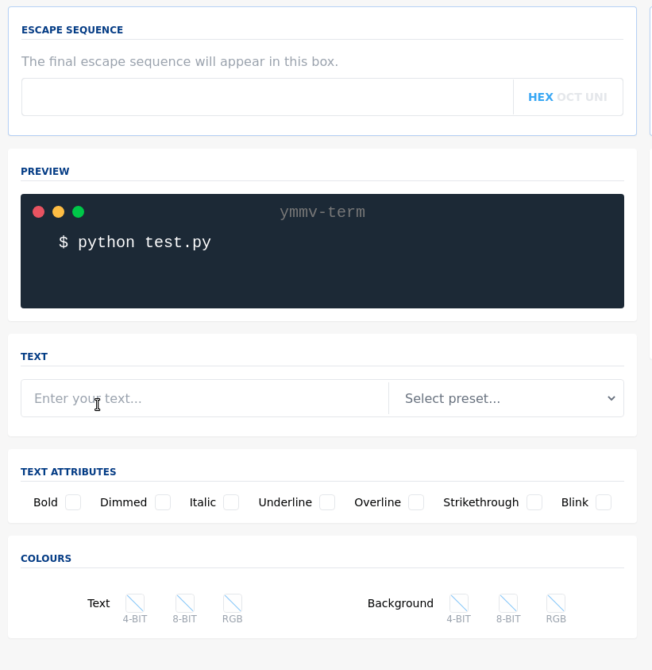

# Ansi Escape Artist

[`Ansi Escape Artist`](https://ansi-escape-artist.surge.sh) is a small webapp for generating ANSI escape sequences quickly, so that adding colourful output and motion to your shell scripts / one-off programs / anything is as lightweight as possible. Rather than add a dependency or wading through the docs, just click a few boxes and copy-and-paste the result.

 

<a href="https://ansi-escape-artist.surge.sh">View the app here</a>

It currently generates sample code for the following languages (but the escape sequences will probably work for many others): 

- `C`
- `C++`
- `Go`
- `Haskell`
- `Java`
- `JavaScript (Node)`
- `Julia`
- `Perl`
- `Python`
- `Ruby`
- `Rust`
- `MIT Scheme`
- `<your language here?>`

## Working with it locally

`npm install` to build the dev environment

`npm run dev` to run the dev environment 

`npm run build` to package for deployment 

## Adding a language (Please feel free!)

To add a language, you need to edit `languages.ts` and update the `Prism.js` bundle to include that language. You need:

- A value for the language in the `LanguageType` enum
- A new `Language` instance, with:
    - An "escape set" (three raw strings representing how it handles octal / hex / unicode escapes, or `undefined` for if it doesn't)
    - A short sample program demonstrating how to produce coloured output in the terminal, with `{{PREFIX}}`, `{{SUFFIX}}` and `{{TEXT}}` placeholders for the escape sequence, the reset sequence, and the user text respectively
    - A string indicating how to invoke it at the command line (ex `$ python test.py`) 
    - The [`Prism.js`](https://prismjs.com/) name for the language
- That's it! 

## FAQ 

- **Q: Why aren't the movement codes working for me?**

- It's possible your program is printing newlines at the end of lines, which means that setting the cursor column won't work
  (since the trailing newline will move to the next line, column `0` again.) Try printing without a newline (in python, it's `print(..., end='')`)

- **Q: Does this work on Windows?**

- It should do with [Windows Terminal](https://github.com/microsoft/terminal) (which is really nice) but unfortunately not with Powershell; see eg [here](https://superuser.com/a/1300251) 

- **Q: Why's there no preview of the movement / sample code for the movement?** 

- I ran out of inspiration - it's a bit harder to show than the colour / font styles. If you have good ideas for this, let me know! 

- **Q: I am a monk of the Qatb Al-esr, and I wonder if you have heard this story: Once at Stanford Knuth lay dreaming. In his dream he beheld ancient Uruk, where Gilgamesh even then was running `find /dev/underworld -name Enkidu` in a terminal wrought of obsidian and burnished bronze.** 

- Please continue. 

- **Q: At that moment, Knuth was awoken by a visitor before he could observe how this terminal colourised output. This knowledge is lost forever. It seems to me that your little webapp could not possibly produce valid escape sequences for this terminal, and as such is not worth my time.** 

- Go boil your head. More seriously, terminal cross-compatibility is pretty thorny (run a commands like `find /lib/terminfo -type f -print` to see what heavyweight solutions like `terminfo` have to deal with). On the other hand, and while there is no [CanIUse](https://caniuse.com/) for terminal compatibility, it seems likely that most people are on something with roughly the same escape handling capabilities. You can run `echo $TERM` to see what you're working with; on my machine I get `xterm-256color`. If you also get that, then most (all?) of the codes generated should work.

## Credits 

- [Li Haoyi's excellent article](https://www.lihaoyi.com/post/BuildyourownCommandLinewithANSIescapecodes.html), without which this would not exist

- [Wiki documentation of ansi escape codes](https://en.wikipedia.org/wiki/ANSI_escape_code)